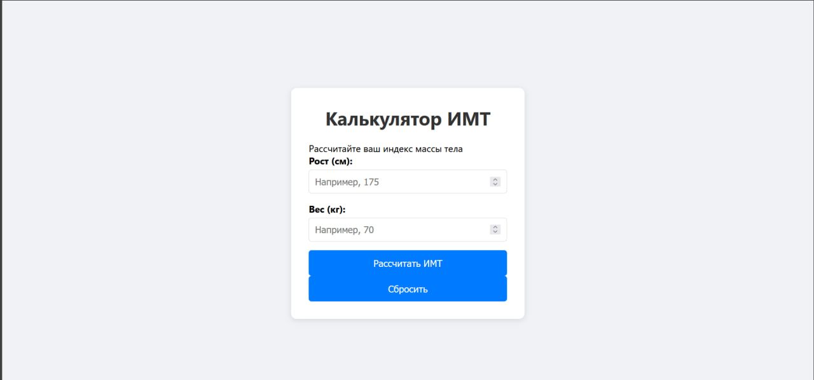
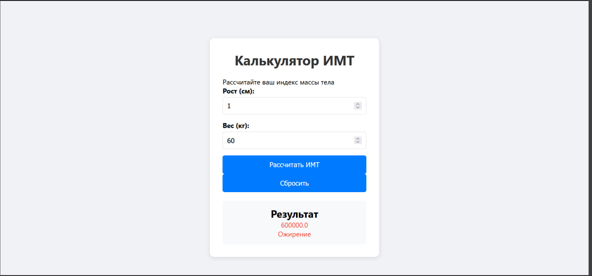

# Калькулятор ИМТ на React

Учебный проект для контрольной работы - калькулятор индекса массы тела.

## Функциональность

- Ввод роста и веса
- Расчет ИМТ по формуле: вес / (рост в метрах)²
- Определение категории (недостаточный, нормальный, избыточный вес, ожирение)
- Цветовая индикация результатов

## Технологии

- React 18
- CSS3 (Flexbox, Grid)
- HTML5

## Скриншоты

### Главный экран


### Результат расчета


##  Вывод
В ходе выполнения контрольной работы было успешно разработано React-приложение "Калькулятор ИМТ".

## ▶️ Запуск

```bash
npm install
npm run dev